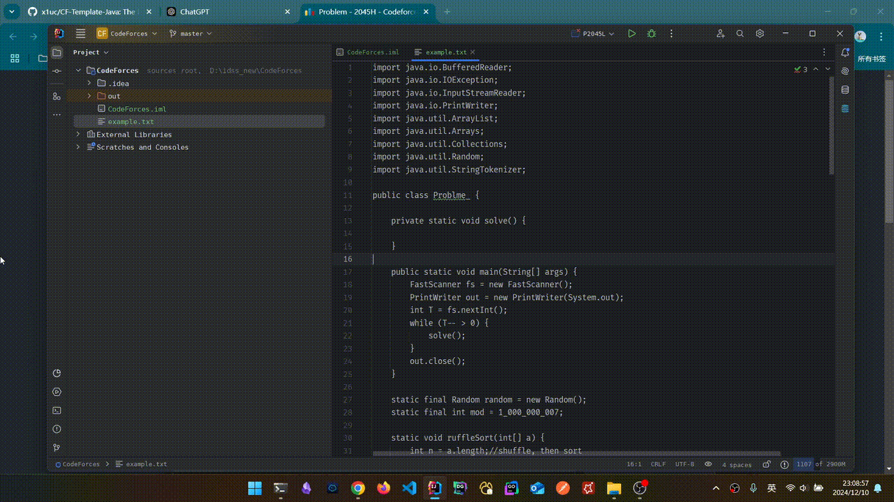

# CF-Template-Java

## Description

1. The IntelliJ plugin used in conjunction with the Chrome extension "competitive-companion".

2. Automatically generate an executable Java file based on your template file (e.g., /asset/example.txt) and the problem information passed by competitive-companion, with the file name and class name dynamically named according to the problem information.

## Config

1. You must have experience using the Chrome extension "competitive-companion."
2. You need to provide the full path name of the template file.
3. The port number needs to be consistent with the one used by the Chrome extension "competitive-companion."

## Use

